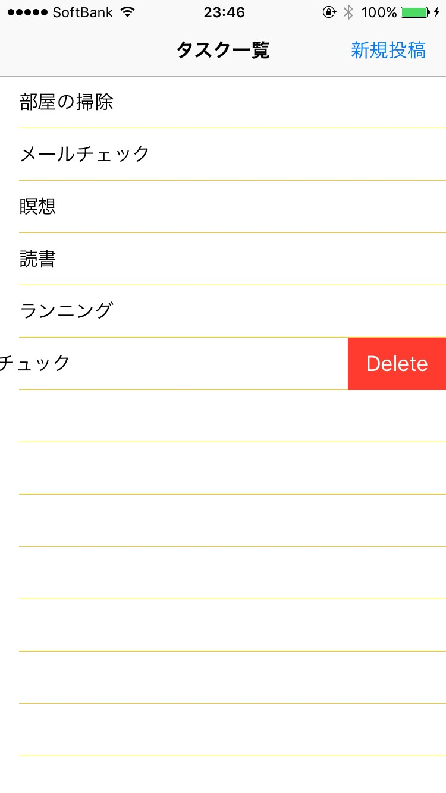
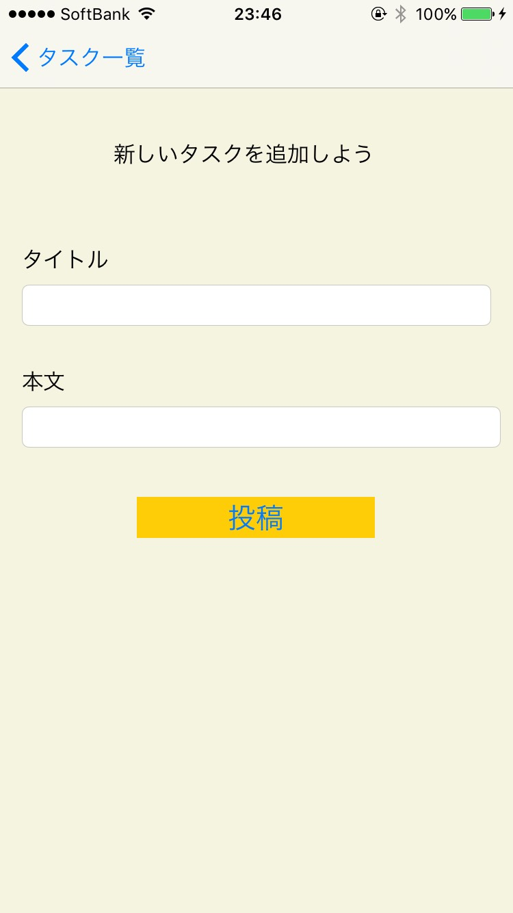

# iosのTodo管理アプリ
* HTTP通信を介して、ruby on railsで構築したデータベースから入出力を行うTodo管理アプリ
* サーバーサイド、ruby on rails学習用に作成

## 実行環境
* clientside：Swift 3.0
* serverside:ruby 2.3.1
* Fram：ruby on rails 4.2.5
* library：Alamofire,SwiftyJSON,ObjectMapper
* server：cloud9
* 対応：iOS 9.0以降 iPhone6、iPhone6s、iPhone7

## スクリーンショット
<--%300x-->
<--%300x-->
